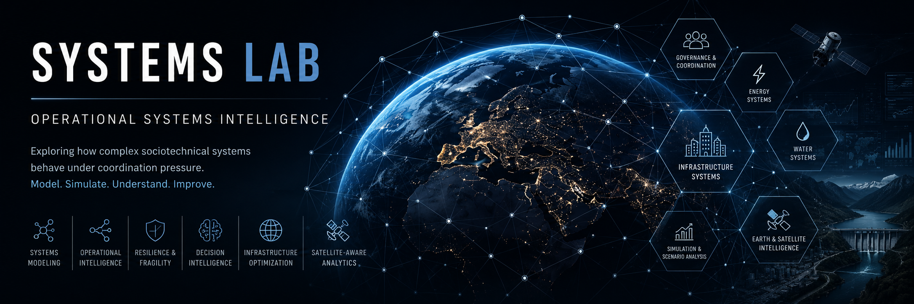
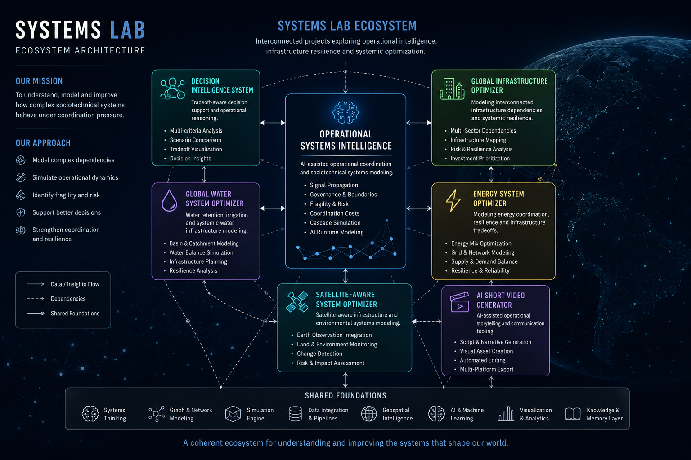
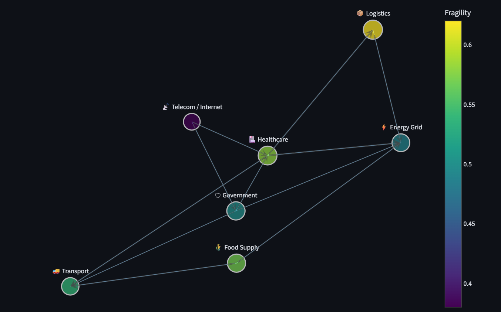
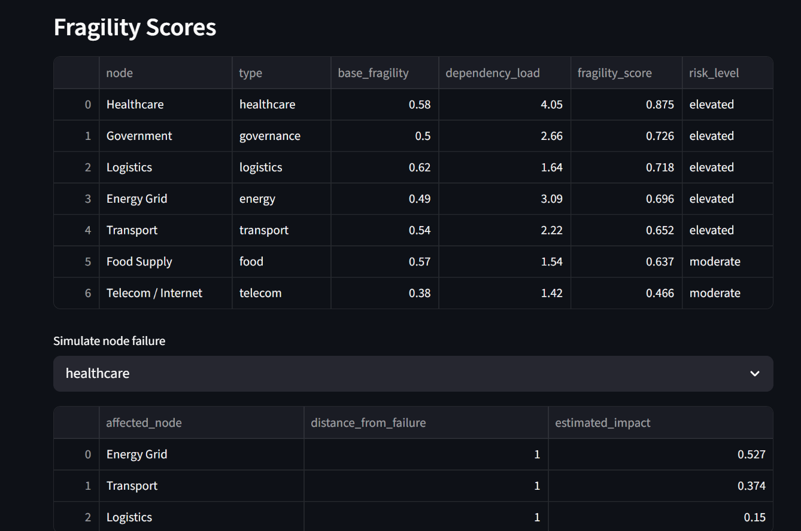
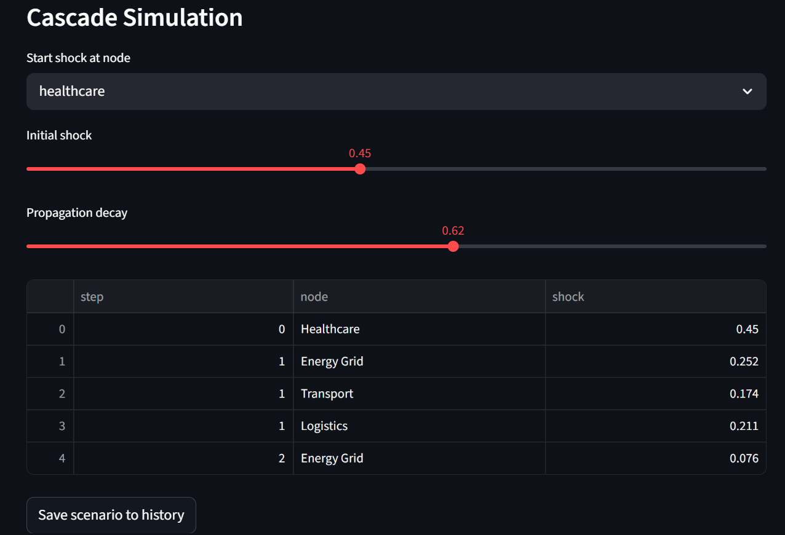

# 🧠 Systems Lab



Exploring how complex sociotechnical systems behave under coordination pressure.

Systems Lab is an ecosystem of projects focused on:

- operational systems intelligence
- infrastructure coordination
- AI-assisted governance
- decision intelligence
- systemic fragility
- organizational dynamics
- complex adaptive systems

The goal is not simply to build software.

The goal is to explore how systems behave when information, authority, dependencies, incentives, and execution interact at scale.

---

# 🌍 Ecosystem Vision

Many large-scale failures are not isolated technical failures.

They emerge from:

- coordination breakdowns
- delayed signals
- governance friction
- dependency overload
- fragmented incentives
- systemic latency
- operational drift
- distorted reporting
- infrastructure fragility

Systems Lab explores these dynamics across:

- infrastructure
- energy
- water
- governance
- logistics
- AI systems
- organizations
- operational coordination
- societal systems

---

# 🏗 Systems Lab Ecosystem Architecture



```text
Systems Lab
│
├── Operational Systems Intelligence
│     ├── governance
│     ├── coordination
│     ├── fragility
│     ├── AI runtime systems
│     ├── signal propagation
│     └── decision intelligence
│
├── Information Flow Simulator
│     ├── signal degradation
│     ├── escalation dynamics
│     ├── organizational bottlenecks
│     ├── communication latency
│     ├── coordination friction
│     └── visibility gaps
│
├── Global Infrastructure Optimizer
│     ├── energy
│     ├── water
│     ├── logistics
│     ├── transport
│     └── telecom
│
├── Satellite-Aware System Optimizer
│
├── Decision Intelligence System
│
├── Energy System Optimizer
│
├── Global Water System Optimizer
│
└── AI Short Video Generator
```

---

# 🚀 Flagship Project

## Operational Systems Intelligence







AI-assisted operational coordination and sociotechnical systems modeling.

Models:

- signal propagation
- governance boundaries
- fragility
- coordination costs
- operational latency
- cascading failures
- runtime system generation
- decision intelligence
- sociotechnical coordination

Repository:

https://github.com/rasient/operational-systems-intelligence

---

# 📦 Ecosystem Repositories

| Project | Focus Area | Description |
|---|---|---|
| Operational Systems Intelligence | Operational Coordination | AI-assisted operational coordination and sociotechnical systems modeling |
| Information Flow Simulator | Organizational Coordination & Signal Propagation | Simulates how information moves, degrades, or gets delayed inside complex systems. |
| Decision Intelligence System | Strategic Reasoning | Tradeoff-aware operational decision modeling |
| Global Infrastructure Optimizer | Infrastructure Systems | Modeling interconnected infrastructure dependencies and resilience |
| Energy System Optimizer | Energy Systems | Modeling energy coordination, resilience, and infrastructure tradeoffs |
| Global Water System Optimizer | Water Infrastructure | Exploring retention, irrigation, and systemic water coordination |
| Satellite-Aware System Optimizer | Geospatial Systems | Satellite-aware infrastructure and environmental systems modeling |
| AI Short Video Generator | Media Systems | AI-assisted operational storytelling and communication tooling |

---

# 🧠 Systems Philosophy

Many systems remain observable but not governable.

Organizations often believe they are in control because they can:

- monitor execution
- collect reports
- explain failures afterward
- preserve operational evidence

But visibility is not the same as governed execution.

The critical question is:

```text
Can a system determine admissibility before consequence becomes binding?
```

---

# 🔬 Research Directions

- operational systems intelligence
- infrastructure coordination
- AI runtime modeling
- governance boundaries
- signal vs noise systems
- cascade simulation
- fragility analysis
- organizational digital twins
- operational cognition systems
- sociotechnical coordination
- decision intelligence
- personal operational intelligence

---

# ⚙ Core Technologies

- Python
- Systems Simulation
- Graph Modeling
- Operational Intelligence
- AI Runtime Modeling
- Geospatial Systems
- Infrastructure Simulation
- Sociotechnical Analysis

---

# 🗺 Ecosystem Roadmap

## Phase 1 — Operational Modeling
Signal propagation, dependency graphs, fragility, latency, coordination systems.

## Phase 2 — Coordination Intelligence
Governance boundaries, operational tradeoffs, cascade simulation, decision intelligence.

## Phase 3 — AI Runtime Systems
AI-assisted runtime modeling, scenario generation, operational memory.

## Phase 4 — Organizational Digital Twins
Persistent multi-system coordination and adaptive operational intelligence.

---

# 🌌 Long-Term Direction

The long-term goal is not simply software tooling.

The direction is toward:

- operational intelligence
- coordination science
- systems philosophy
- AI-assisted governance
- sociotechnical systems modeling
- infrastructure resilience
- multi-scale system simulation

Ultimately exploring:

```text
What should a person, organization, or institution do inside a complex system to produce the best long-term outcome?
```

---

# 👤 Author

Alexander Berg

Exploring:

- Sociotechnical Systems
- Operational Systems Intelligence
- Infrastructure Coordination
- Systems Philosophy
- AI-Augmented Governance
- Complex Adaptive Systems

---

# 🔗 Main Ecosystem Repository

https://github.com/rasient/systems-lab
